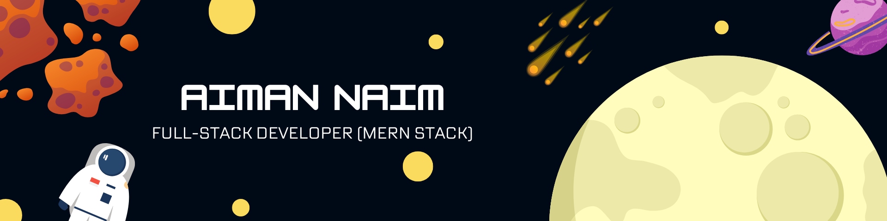

  

###

<h1 align="left">Hi 👋, Aiman Naim here</h1>

I am a recent graduate with a BSc in Computer Science (Hons.) with a first-class degree, passionate about full stack development. 
With nearly 2 years of hands-on programming experience during my university life, I thrive on the challenges of developing websites from scratch. I have honed my skills in front-end technologies like React.js, as well as back-end technologies including Node.js, Express.js, MongoDB, and PostgreSQL.

 

<h2 align="left">🔨Language and Tools:</h2>

  
  
  
  
  
  
  
  
  
  
  
  
  
  
  
  
  
  
  

###

<h2 align="left">🔥My Stats</h2>

###

  
  
  

###

<h2 align="left">Connect with me:</h2>

###

  
  
  
  

###

## Hi there! 👋

I'm Aiman Naim, an Associate Technology Consultant specializing in Digital Engineering. I work as a full-stack developer with a passion for building innovative solutions. Let's create something amazing together!

## About Me

Based in Selangor, Malaysia, I currently work at EY Malaysia. With a background in technology consulting, I focus on delivering high-quality digital solutions. My journey in tech has equipped me with the skills to tackle complex challenges.

## Skills & Technologies

angular,react,docker,mongodb,nodejs,express,github,bootstrap

## Top Projects

- [GadgetUniverse](https://github.com/aimxnaim/GadgetUniverse): A full eCommerce site built using MERN stack. ⭐ 0 Stars
- [CampVenture](https://github.com/aimxnaim/CampVenture): A project built with Node.js, Express, and MongoDB for managing camp activities. ⭐ 0 Stars
- [password-manager](https://github.com/aimxnaim/password-manager): A project for managing passwords securely, developed as part of a group project. ⭐ 0 Stars

## GitHub Stats

🏆 **Public Repositories**: 9  
👥 **Followers**: 4  
🔗 **Following**: 9  

## Connect with Me

{"linkedin":"https://www.linkedin.com/in/aimannaimfaizul/","instagram":"https://www.instagram.com/aimxnaim/"}

